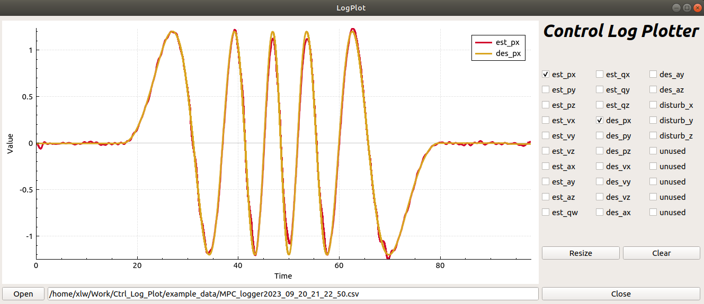

### Description: Controller Log Plotter. 
The data format can refer to the example_data or as the following. The content can be recorded freely for automatic recognition, but the first column must to be timestamp.
```
timestamp,est_px,est_py,est_pz,...
1695219468850140796,-0.0063955,-0.0103323,-0.0541671,...
1695219468850140896,-0.0063955,-0.0103323,-0.0541671,...
..., ..., ..., ...
```

#### 1. depends:

    ubuntu 20.04 and qt5 (如果已安装ros, qt无需额外安装)


#### 2. build:


```
cd build
qmake ../LogPlot.pro
make
./LogPlot
```

#### 3. example:
MPC log example:


#### issue may occur

```
**issue** : qmake: could not exec '/usr/lib/x86_64-linux-gnu/qt4/bin/qmake': No such file or directory

**solution** " export PATH=/usr/lib/x86_64-linux-gnu/qt5/bin:$PATH
```
