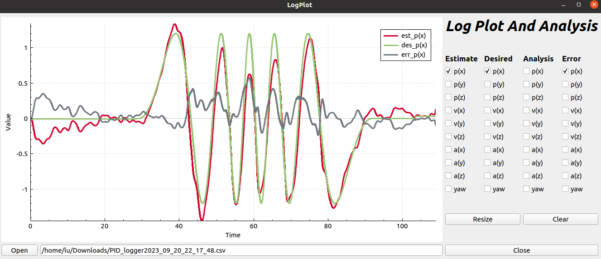
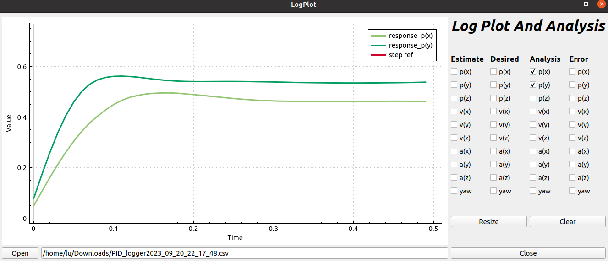

#### 1. depends:

    ubuntu 20.04 and qt5 (如果已安装ros, qt无需额外安装)

```
pip install numpy scipy
```

#### 2. build:


```
cd build
qmake ../LogPlot.pro
make
./LogPlot
```

#### 3. example:

pid log plot


step response plot


#### issue may occur

```
**issue** : qmake: could not exec '/usr/lib/x86_64-linux-gnu/qt4/bin/qmake': No such file or directory

**solution** " export PATH=/usr/lib/x86_64-linux-gnu/qt5/bin:$PATH
```

#### 4. TODO & bug：

1. The current log is plotted based on the recorded order, because the labels of the laboratory's controllers are messy. They will be plotted by label soon.

2. the step response of position / velocity looks incorrect, but the programe works well for attitude control log...
